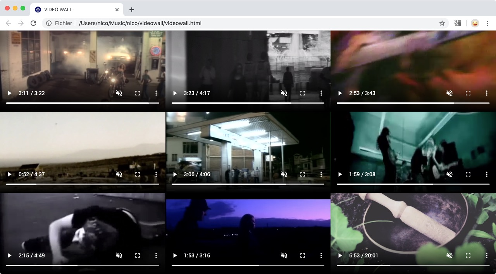

# VIDEO WALL

<p style="text-align:center">
    
</p>

## Prerequisites

-   A web browser
-   Python3 (optional)

## Description

This is a simple video wall that runs in a browser without the need for a web server.
The layout can be changed.
As browsers do not have access to the file system, the list of video files must be generated and saved in a playlist in JavaScript format.
The defautlt playlist is called `playlist.js`, but this can be overridden with a GET parameter.

## Playlist format

```javascript
"use strict";

// STARTUP_DEFAULTS are optional in `playlist.js`.
// If given, they override the STARTUP_DEFAULTS defined in videowall.html.
var STARTUP_DEFAULTS = {
    BEGIN_AT: 0.01, // Time offset if you don’t want to start at the beginning of the video. Time offset is expressed as a fraction of the total time, i.e. from 0 to 1.
    NB_VIDEOS_MAX: 6 ** 2, // Can take the value 2 or any perfect square number (1, 4, 9, 16,...).
    NB_VIDEOS: 9, // Number of videos visible on startup. Same constraints as NB_VIDEOS_MAX.
    TITLE: "TOP 100", // Overridde the default title.
};

var PLAYLIST = [
    "../file_1.mp4",
    "../file_2.mp4"
];
```

## Usage

-   Generate the playlist.js file that will contain the path to the videos.
    This can be done by hand or with the following python script:

```bash
python3 make_playlist.py
```

-   Double click `videowall.html` to open it in your browser.

## Shortcuts

-   <kbd>↑</kbd> Increase layout density.
-   <kbd>↓</kbd> Decrease layout density.
-   <kbd>Shift+0..9</kbd> Change player layout.
-   <kbd>0..9</kbd> Go to relative time for track under the mouse cursor.
-   <kbd>§</kbd> Go to the end for track under cursor.
-   <kbd>Shift+Alt+→</kbd> Moves 100 tracks forward in the playlist.
-   <kbd>Alt+→</kbd> Moves 10 tracks forward in the playlist.
-   <kbd>Shift+→</kbd> Moves 1 track forward in the playlist.
-   <kbd>→</kbd> Seek forward 5 seconds for track under the mouse cursor.
-   <kbd>Shift+Alt+→</kbd> Moves 100 tracks backward in the playlist.
-   <kbd>Alt+→</kbd> Moves 10 tracks backward in the playlist.
-   <kbd>Shift+→</kbd> Moves 1 track backward in the playlist.
-   <kbd>→</kbd> Seek backward 5 seconds for track under the mouse cursor.
-   <kbd>y</kbd> Moves 1 track backward in the playlist.
-   <kbd>x</kbd> Moves 1 track forward in the playlist.
-   <kbd>s</kbd> Shuffle the order of the playlist.
-   <kbd>i</kbd> Open the track under the mouse cursor in another tab and copy the URL in the clipboard.
-   <kbd>Home</kbd> Seek to the beginning of the video.
-   <kbd>End</kbd> Seek to the last seconds of the video.
-   <kbd>j</kbd> Seek backward 10 seconds in track under the mouse cursor.
-   <kbd>k</kbd> Toggle play and pause in all players.
-   <kbd>l</kbd> Seek forward 10 seconds in track under the mouse cursor.
-   <kbd>,</kbd> Skip to the next frame.
-   <kbd>.</kbd> Skip to the previous frame.
-   <kbd>m</kbd> Mute / unmute the track under the mouse cursor.
-   <kbd>r</kbd> Toggle video object fit mode between “cover” mode and “contain” mode for all videos.
-   <kbd>f</kbd> Full screen the video under the mouse cursor.¹
-   <kbd>t</kbd> Toggle thumbnail / video view.
-   <kbd>></kbd> Speed up the track playback rate.
-   <kbd><</kbd> Slow down the track playback rate.
-   <kbd>?</kbd> Open help file.

¹ If you’re using a Blink-based browser (Chrome, Opera, Brave...), use the <kbd>f</kbd> shortcut to switch to full screen because if you use the built-in full screen button, the other keyboard shortcuts will no longer work.

## Web browser compatibility on macOS

-   Blink-based browsers (Chrome, Opera, Brave...) work best.
-   Safari, but the Developer tools need to be activated and the browser relaunched.
-   Firefox, works but the videos may not play at start, you need to press k, ← or → .
